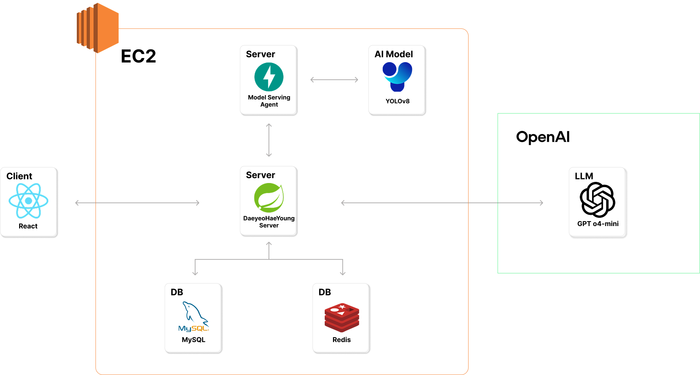

# 대여해영

대학생활 스마트 대여 플랫폼

---

## 📌 목차

- [소개](#-소개)
- [기술 스택](#-기술-스택)
- [프로젝트 구조](#-프로젝트-구조)
- [설치 및 실행 방법](#-설치-및-실행-방법)
- [환경 변수 설정](#-환경-변수-설정)
- [팀원 및 팀 소개](#-팀원-및-팀-소개)
- [기술 스택](#️-기술-스택)
- [주요 기능](#-주요-기능)
- [아키텍처](#-아키텍처)
- [API 문서](#-api-문서)
- [기여 방법](#-기여-방법)

---

## 📖 소개

> 대여해영은 대학교 대여 사업에서 대면 절차를 줄이고, 수기 행정 없이 온라인으로 물품을 대여할 수 있는 스마트 대여 플랫폼입니다.

---

## 🛠 기술 스택

- **Backend**: Spring Boot, JPA, Spring Batch, Spring Security
- **Frontend**: React
- **Database**: MySQL, Redis
- **Infra**: AWS EC2, S3, Docker
- **Etc**: Swagger, OpenAI API

---

## 📂 프로젝트 구조

```
shinhan/
├─ public/                 # PWA 아이콘, 폰트 등 정적 리소스
├─ resources/              # 아키텍처, 프로젝트 이미지
├─ src/
│  ├─ api/                 # API 클라이언트, axios 래퍼
│  ├─ assets/              # 로고, 이미지 리소스
│  ├─ components/          # 공통 컴포넌트 (Button, Card, Modal 등)
│  ├─ pages/               # 주요 페이지 (admin, qr, rent, mypage 등)
│  ├─ routes/              # 라우팅 설정
│  ├─ stores/              # zustand 전역 상태 관리
│  ├─ stories/             # Storybook 예시 및 에셋
│  ├─ theme/               # Chakra UI 테마 정의
│  └─ App.tsx / main.tsx   # 앱 엔트리 포인트
├─ .storybook/             # Storybook 설정
├─ .env                    # 환경 변수
├─ eslint.config.js        # ESLint 설정
├─ vite.config.ts          # Vite 설정
├─ tsconfig*.json          # TS 설정
└─ README.md

```

---

# 설치 및 실행 방법

### 1. 저장소 클론

```

git clone https://github.com/Shinhan-DaeyeohaeYoung/Frontend.git

cd Frontend

```

### 2. 환경 변수 설정

`.env` 파일에 환경 변수를 설정합니다. [환경 변수 설정](http:/#-%ED%99%98%EA%B2%BD-%EB%B3%80%EC%88%98-%EC%84%A4%EC%A0%95) 참고.

### 3. 실행

## node.js 설치

`22.17.0 버전 설치`

## localhost 개발서버 실행

```

npm i
npm run dev

```

http://localhost:5173 으로 접속할 수 있습니다.

---

# **⚙ 환경 변수 설정**

```

VITE_BASE_URL=${VITE_BASE_URL}

```

---

## 👏 팀원 및 팀 소개

|                               신승용                                |                          윤규성                          |                        이지혜                         |
| :-----------------------------------------------------------------: | :------------------------------------------------------: | :---------------------------------------------------: |
|       |  |  |
|                              BE, 팀장                               |                            FE                            |                          FE                           |
| 대여, 예약, 대기열, 알림 도메인 구현, 인프라 구축, 배치 시스템 구축 | 유저, 보증금, 금융망 API, 조직, 학교 포인트 도메인 구현  |       대여, 반납, 물품, Open AI, QR 도메인 구현       |

|                               길태은                                |                            안수진                            |
| :-----------------------------------------------------------------: | :----------------------------------------------------------: |
|             |    |
|                                 FE                                  |                              FE                              |
| 관리자 사이드 대여-반납 흐름, PWA 세팅, 전역 상태관리(모달, 사용자) | 유저 사이드 대여-반납 흐름, 페이지 레이아웃 및 공통 컴포넌트 |

---

## 🗂️ 기술 스택

### Frontend


### Backend


### Database


### Infra & DevOps


### Tools


---

## ✨ 주요 기능

- 대여/반납 시스템
  - QR 코드 스캔
  - AI 기반 파손율 판단
- 예약 및 대기열 시스템
  - 실시간 대기열 관리
  - 예약 알림
- 보증금 입출금 자동화- SOL 모임통장
  - 관리자 대시보드
  - 실시간 통계 및 보고서
  - 사용자 관리

## 🪜 아키텍처



---

## 🤝 기여 방법

1. 이슈 생성 또는 할당
2. `feature/브랜치명`으로 작업
3. 작업 완료 후 PR 생성
4. Merge 후 배포

---

```

```
